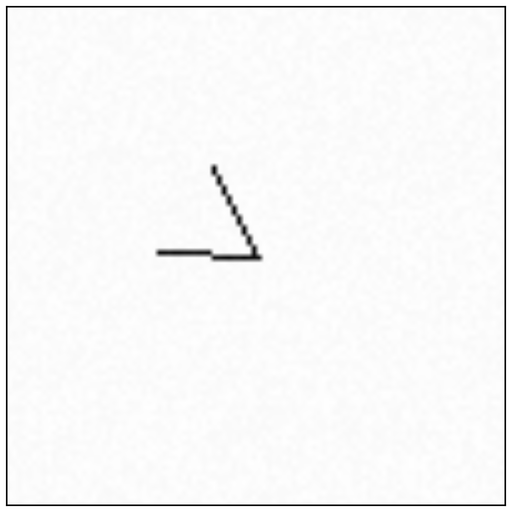
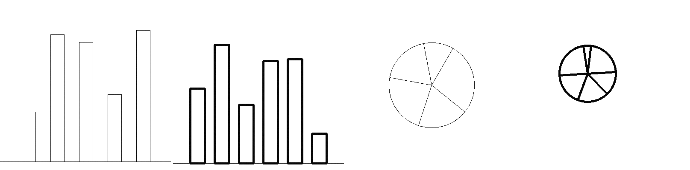
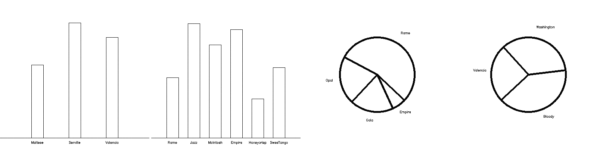

<h2>Chart Question Answering Challenge</h2>

The CQA challenge includes 3 levels of perception: from  low-level visualization building blocks to semantic reasoning that requires text extraction.  

<h3>Low-level:</h3> Can your model measure Cleveland and McGill's 1984 Angle and Length stimuli? Does your model succeed even in cases of x-position, y-position, and stroke width variations? What about Cleveland and McGill's 1985 images?

 
<a href="https://drive.google.com/file/d/1X1o8Mkn3t4rnZvAnUWABJMhByG8GFNc8/view?usp=sharing" target="_blank" class='lightgray'>Training and test sets now available!</a>

  

<h3>Mid-level:</h3> What about simple bar and pie charts? Can your model successfully compare ratios - even with stroke width variations?

 
<a href="https://drive.google.com/file/d/1o6EMJjpiLnvVzftOB_FJlzYid-QbJI6N/view?usp=sharing" target="_blank" class='lightgray'>Training and test sets now available!</a>

  

<h3>High-level:</h3> Now, images contain textual information. Can your model answer questions regarding the data? Can it generalize between apples and oranges? 

 
<a href="https://drive.google.com/file/d/1zyqj6M5ug-57ohxmgTogCMrxb33_7w8x/view?usp=sharing" target="_blank" class='lightgray'>Training and test sets now available!</a>
