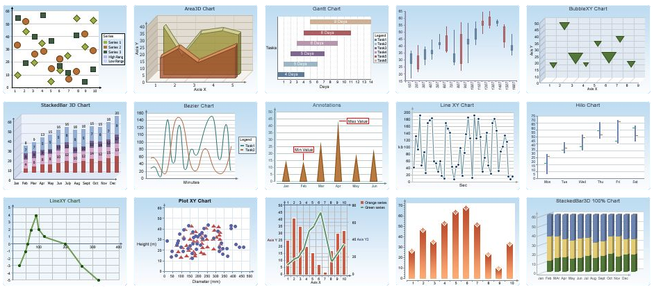

 
<!--

  

     <a href='https://mpsych.org/join/'>JOIN US!</a>
  

-->

IMPORTANT: <a href="https://umassboston.zoom.us/j/93635253545" target="_blank">ZOOM LINK</a> (Meeting ID: 936 3525 3545)!

The field of chart question answering (CQA) has begun to combine analyses of images and text in visualizations using recent advances in computer vision and natural language processing. 

Ideally, computational methods might mimic human chart perception, but how to best use computational approaches in ways that benefit from knowledge of human visual inference remains an open question, among many other unexplored research opportunities in CQA. 
  
This workshop has three goals: (1) cognition researchers will introduce concepts of human chart perception to inspire algorithmic design, (2) computer scientists will present state-of-the-art machine learning techniques for chart analysis including respective limitations, (3) our proposed algorithmic challenge and call for submissions will spur the development of new CQA systems.

 

<h2 style='text-align:left'><a href="{{ site.baseurl }}/research" class="cleanlink">DATES</a></h2>
<strike>mid-February 2021: <a href="/challenge" class="bluetext">CQA Challenge Available!</a></strike> 
<strike>June 15th 2021: <a href="/submission" class="bluetext">Paper Submission Due</a></strike> 
<strike>June 21st 2021: Challenge Submission Due</strike> 
<strike>June 21st 2021: Electronic Poster Deadline</strike> 
June 25th 2021: Workshop!  

<h2 style='text-align:left'>ORGANIZERS</h2>

<table>
  <tr>
    <td></td>
    <td style='padding-left:10px;vertical-align: middle'>
      <a href='https://mpsych.org' target='_blank'>Daniel Haehn</a>
       University of Massachusetts Boston
    </td>
  </tr>
  <tr>
    <td></td>
    <td style='padding-left:10px;vertical-align: middle'>
      <a href='https://groups.cs.umass.edu/nmahyar/' target='_blank'>Narges Mahyar</a>
       University of Massachusetts Amherst
    </td>
  </tr>
  <tr>
    <td></td>
    <td style='padding-left:10px;vertical-align: middle'>
      <a href='https://visualthinking.psych.northwestern.edu/' target='_blank'>Steven Franconeri</a>
       Northwestern University
    </td>
  </tr>
  <tr>
    <td></td>
    <td style='padding-left:10px;vertical-align: middle'>
      <a href='http://users.eecs.northwestern.edu/~jhullman/' target='_blank'>Jessica Hullman</a>
       Northwestern University
    </td>
  </tr>
  <tr>
    <td></td>
    <td style='padding-left:10px;vertical-align: middle'>
      <a href='https://nikokriegeskorte.org/' target='_blank'>Nikolaus Kriegeskorte</a>
       Columbia University
    </td>
  </tr>
  <tr>
    <td></td>
    <td style='padding-left:10px;vertical-align: middle'>
      <a href='https://vcg.seas.harvard.edu/' target='_blank'>Hanspeter Pfister</a>
       Harvard University
    </td>
  </tr>
</table>

<h2 style='text-align:left'><a href="https://twitter.com/mpsychUMB" target="_blank" class="cleanlink">PRESENTATION SCHEDULE</a></h2>

<!--  -->
 

<small>
3:00p WELCOME 
3:10p Steve Franconeri (Human Chart Perception I) 
3:30p Cindy Xiong (Human Chart Perception II) 
3:50p Christina M. Funke (Human versus Machine Perception) 
4:10p BREAK 1 
4:15p Zoya Bylinskii (Computational Visualization Analysis) 
4:35p Kushal Kafle (Pioneering work in CQA) 
4:55p Ani Kembhavi (Visual Diagram Understanding) 
5:15p BREAK 2: CHALLENGE WINNERS + POSTERS 
5:35p Samira E. Kahou (Datasets for Visual Reasoning) 
5:55p Ritwick Chaudhry (Chart Question Answering Methods) 
6:15p Dae Hyun Kim (Natural Language Processing for CQA) 
6:35p Yunhai Wang (Human-Inspired Relation Networks for CQA) 
6:55p CLOSING REMARKS  
</small>

Speaker bios are available <a href="/schedule" class="bluetext">here</a>.

 

