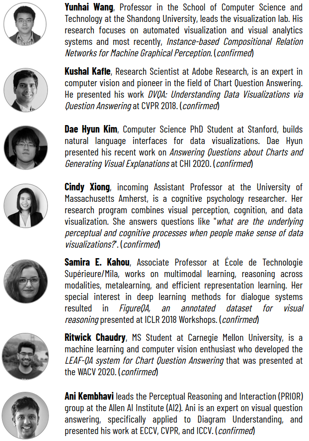
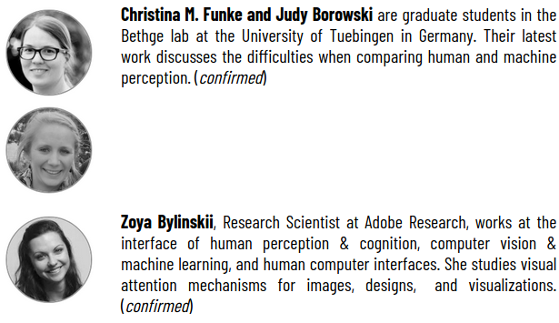

<h2>Presentation Schedule</h2>

WORKSHOP DATE 6/25/2021 - ALL TIMES IN EST!  

3:00p WELCOME 
3:10p Steve Franconeri (Human Chart Perception I) 
3:30p Cindy Xiong (Human Chart Perception II) 
3:50p Christina M. Funke (Human versus Machine Perception) 
4:10p BREAK 1 
4:15p Zoya Bylinskii (Computational Visualization Analysis) 
4:35p Kushal Kafke (Pioneering work in CQA) 
4:55p Ani Kembhavi (Visual Diagram Understanding) 
5:15p BREAK 2: CHALLENGE WINNERS + POSTERS 
5:35p Samira E. Kahou (Datasets for Visual Reasoning) 
5:55p Ritwick Chaudhry (Chart Question Answering Methods) 
6:15p Dae Hyun Kim (Natural Language Processing for CQA) 
6:35p Yunhai Wang (Human-Inspired Relation Networks for CQA) 
6:55p CLOSING REMARKS  

